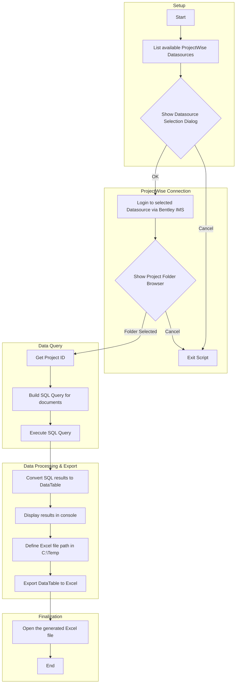

# From REST to Raw Speed: Building a ProjectWise Doc Register with SQL (and a Friendly UI)

## TL;DR: 
Last time, I pulled a ProjectWise document list with the WSG REST API — reliable, supported, and portable. This time, I’m going straight to the database with SQL via PowerShell for speed and flexibility. Added bonus: a WinForms UI so you can pick a datasource and folder without typing. The script:

Lets you select a datasource from a dropdown

Lets you browse for a folder in ProjectWise

Runs a read-only SQL query to get the latest doc versions

Exports the results to Excel in seconds

Use SQL if you have DB access and need results fast. Use WSG if you want official, portable, no-DB-required queries.

[GIF: Star Wars hyperspace jump]


## Story
Last issue, I pulled a document list with the WSG REST API. It was tidy, blessed, and very “by the book.”

But sometimes… you want raw speed. No paging, no property decoding, no waiting for the API to sip its coffee.

This time I’m going straight to the source — the ProjectWise database — with a single SQL statement. And yes, we’re doing it in PowerShell. And yes, we’re giving it buttons.

The result: a one-click document register to Excel. You choose a datasource, browse to a project folder, and out pops a register. No paging. No loops. No “let me decode that WSG payload for you” step.

[GIF: MCU Quicksilver doing the slow-mo speed run]


## What we’re building
A PowerShell script with a WinForms dropdown and folder browser

A direct SQL query (read-only) that targets your chosen folder + subfolders

An Excel export with project number + timestamp in the filename

### Flowchart explaining the process


## When to use this vs WSG (the 10-second version)
Use SQL when you have DB access and need speed + full control over joins/columns.

Use WSG when you want officially supported, portable, and no DBA required.


## Prerequisites
Windows PowerShell 5.1 (or PowerShell 7 started with -STA for WinForms)

PWPS_DAB module (ProjectWise cmdlets)

ImportExcel module for Export-Excel

Read-only access to the ProjectWise DB via Select-PWSQL (through PWPS_DAB)


## Step-by-step (with “why” sprinkled in)
Pick your datasource Dropdown lists your PW datasources so you don’t fat-finger names. The combobox is bound to a Name property so it shows actual names.

Pick your folder We use the standard PW folder browser. The SQL leverages dsqlGetSubFolders to include all subfolders.

Run the SQL Two queries in this example:

Export to Excel Converts to a DataTable, timestamps the filename, and writes a neat worksheet named with the project number.

(Optional) Quick preview Swap in a DataGridView for an instant grid preview.

[GIF: Friends “Pivot!” couch scene—because yes, we’re pivoting from REST to SQL]


## The code

### Prerequisites
``` powershell
#requires -Version 5.1
# If using PowerShell 7, start as: pwsh.exe -STA

#region "Check Powershell Modules required are install and imported"
$Modules = @([PSCustomObject]@{Name = "PWPS_DAB" }, [PSCustomObject]@{Name = "ImportExcel" })
foreach ($Module in $Modules) {
    $ModuleName = $Module.Name
    $isInstalled = (Get-Module -ListAvailable -Name $ModuleName).Count -gt 0
    $isImported = (Get-Module -Name $ModuleName).Count -gt 0

    if ($isInstalled -and $isImported) {
        Write-Host "$ModuleName is installed and imported."
    }
    elseif ($isInstalled -and -not $isImported) {
        Write-Host "$ModuleName is installed but not imported. Importing now..."
        Import-Module $ModuleName -ErrorAction Stop 
    }
    else {
        Write-Host "$ModuleName is not installed. Installing now..."
        Install-Module -Name $ModuleName -Scope CurrentUser -Force
        Import-Module $ModuleName -ErrorAction Stop
    }
}
#endregion
```

### Winform Dialog Function
``` powershell
function Show-ComboBoxDialog {
    [CmdletBinding()]
    param(
        [Parameter(Mandatory)]
        [string]$Title,
        [Parameter(Mandatory)]
        [array]$ComboBoxItems,
        [string]$DisplayMember = $null
    )

    Add-Type -AssemblyName System.Windows.Forms
    Add-Type -AssemblyName System.Drawing
    [System.Windows.Forms.Application]::EnableVisualStyles()

    $form = New-Object System.Windows.Forms.Form
    $form.Text = $Title
    $form.Size = New-Object System.Drawing.Size(450, 200)
    $form.StartPosition = 'CenterScreen'
    $form.TopMost = $true

    $comboBox = New-Object System.Windows.Forms.ComboBox
    $comboBox.Location = New-Object System.Drawing.Point(50, 30)
    $comboBox.Size = New-Object System.Drawing.Size(350, 30)
    $comboBox.DropDownStyle = [System.Windows.Forms.ComboBoxStyle]::DropDownList
    if ($DisplayMember) { $comboBox.DisplayMember = $DisplayMember }
    $comboBox.Items.AddRange($ComboBoxItems)

    if ($ComboBoxItems.Count -gt 0) { $comboBox.SelectedIndex = 0 }

    $okButton = New-Object System.Windows.Forms.Button
    $okButton.Text = 'OK'
    $okButton.Location = New-Object System.Drawing.Point(50, 80)
    $okButton.Add_Click({
        $form.DialogResult = [System.Windows.Forms.DialogResult]::OK
        $form.Close()
    })

    $cancelButton = New-Object System.Windows.Forms.Button
    $cancelButton.Text = 'Cancel'
    $cancelButton.Location = New-Object System.Drawing.Point(150, 80)
    $cancelButton.Add_Click({
        $form.DialogResult = [System.Windows.Forms.DialogResult]::Cancel
        $form.Close()
    })

    $form.Controls.Add($comboBox)
    $form.Controls.Add($okButton)
    $form.Controls.Add($cancelButton)
    $form.AcceptButton = $okButton
    $form.CancelButton = $cancelButton
    $form.Add_Shown({ $form.Activate() })

    $result = $form.ShowDialog()
    if ($result -eq [System.Windows.Forms.DialogResult]::OK) { return $comboBox.SelectedItem }
    return $null
}
```
### Custom Convert to DataTable Function
``` powershell
function ConvertTo-DataTable {
    [CmdletBinding()]
    param(
        [Parameter(Mandatory, ValueFromPipeline)]
        [PSObject[]]$InputObject
    )
    BEGIN { $dataTable = New-Object System.Data.DataTable; $columnsAdded = $false }
    PROCESS {
        foreach ($obj in $InputObject) {
            if (-not $columnsAdded) {
                foreach ($prop in $obj.PSObject.Properties) {
                    $type = if ($prop.Value -eq $null) { [string] } else { $prop.Value.GetType() }
                    [void]$dataTable.Columns.Add($prop.Name, $type)
                }
                $columnsAdded = $true
            }
            $row = $dataTable.NewRow()
            foreach ($prop in $obj.PSObject.Properties) {
                try { $row[$prop.Name] = $prop.Value } catch { $row[$prop.Name] = [string]$prop.Value }
            }
            [void]$dataTable.Rows.Add($row)
        }
    }
    END { $dataTable }
}
```

### 1) Pick a datasource
``` powershell
$Datasources = Show-PWDatasources
$pwDatasources = foreach ($d in $Datasources) { [PSCustomObject]@{ Name = $d } }

$result = Show-ComboBoxDialog -Title 'Select a Datasource' -ComboBoxItems $pwDatasources -DisplayMember 'Name'
if (-not $result) { Write-Host 'Cancelled.'; return }
$dataSource = $result.Name
```

### 2) Login
``` powershell
New-PWLogin -DatasourceName $dataSource -BentleyIMS -NonAdminLogin | Out-Null
```
### 3) Pick a folder
``` powershell
$projectFolder = Show-PWFolderBrowserDialog -DialogTitle 'Browse for project'
if (-not $projectFolder) { Write-Host 'No folder selected.'; return }

$projectFolderName  = $projectFolder.Name
$projectNumber      = $projectFolder.ProjectProperties['PROJECT_Project_Number']
$ProjectID          = $projectFolder.ProjectID
$ReportDate         = Get-Date -Format 'yyyy-MM-dd_HH-mm'
```
### 4) SQL queries
``` powershell
$sqlLatestPerOrigGuid = @"
SELECT
    D.o_docguid           AS DocGuid,
    D.o_itemname          AS Document_Name,
    D.o_dmsdate           AS CheckedOut_Date,
    D.o_version           AS Version,
    S.o_statename         AS State,
    D.o_origguid,
    D.o_version_seq
FROM dms_doc D
JOIN dms_stat S ON D.o_stateno = S.o_stateno
JOIN (SELECT o_projectno FROM dbo.dsqlGetSubFolders(1, $ProjectID, 0)) AS SubProjects
  ON D.o_projectno = SubProjects.o_projectno
JOIN (
    SELECT o_origguid, MAX(o_version_seq) AS MaxSeq
    FROM dms_doc
    WHERE o_projectno IN (SELECT o_projectno FROM dbo.dsqlGetSubFolders(1, $ProjectID, 0))
      AND o_size <> 0
    GROUP BY o_origguid
) AS MaxVersions
  ON D.o_origguid = MaxVersions.o_origguid AND D.o_version_seq = MaxVersions.MaxSeq
WHERE D.o_size <> 0
ORDER BY D.o_itemname;
"@

$sqlTopLevelDocs = @"
SELECT
    D.o_docguid           AS DocGuid,
    D.o_itemname          AS Document_Name,
    D.o_dmsdate           AS CheckedOut_Date,
    D.o_version           AS Version,
    S.o_statename         AS State
FROM dms_doc D
JOIN dms_stat S ON D.o_stateno = S.o_stateno
JOIN (SELECT o_projectno FROM dbo.dsqlGetSubFolders(1, $ProjectID, 0)) AS SubProjects
  ON D.o_projectno = SubProjects.o_projectno
WHERE D.o_size <> 0
  AND D.o_origguid IS NULL
ORDER BY D.o_itemname;
"@

$sqlStatement = $sqlLatestPerOrigGuid  # or $sqlTopLevelDocs
Set-Clipboard -Value $sqlStatement
```
### 5) Run SQL and export
``` powershell
$SQLResults = Select-PWSQL -SQLSelectStatement $sqlStatement
if (-not $SQLResults) { Write-Warning 'No results.'; return }

$dt = $SQLResults | ConvertTo-DataTable
$FileName = "C:\Temp\${projectFolderName}-DocumentRegister_${ReportDate}.xlsx"
$sheet   = if ($projectNumber) { "$projectNumber-DocReg" } else { "DocReg" }

$null = New-Item -ItemType Directory -Path (Split-Path $FileName) -Force
$dt | Export-Excel -Path $FileName -WorksheetName $sheet -AutoSize

Write-Host "Exported: $FileName"
```

## WSG vs SQL — the “how it feels” comparison
WSG (REST) Predictable, supported, works everywhere WSG works. You’ll do paging, decode properties, and loop results. Perfect for service accounts and cloud-friendly scripts.

SQL (read-only) Fast and flexible—especially for register reporting. You can join to anything. But you need DB access, and schema changes can break queries.


## Side-by-side snippet
### WSG
``` powershell
$top = 100; $skip = 0; $all = @()
do {
  $url = "$base/repositories/PW_WSG/Document!poly?`$top=$top&`$skip=$skip&$filter=FolderId eq '$FolderId'"
  $page = Invoke-WSG -Method GET -Uri $url
  $all += $page.instances
  $skip += $top
} while ($page.instances.Count -eq $top)

$all | Select-Object Name, Version, State | Export-Excel C:\Temp\WSG-DocReg.xlsx
```
### SQL
``` powershell
$SQLResults = Select-PWSQL -SQLSelectStatement $sqlLatestPerOrigGuid
$SQLResults | Export-Excel C:\Temp\SQL-DocReg.xlsx
```

## Lessons learned
WinForms needs STA: Use Windows PowerShell 5.1 or start PS7 with -STA.

DisplayMember matters: Without it, your combobox shows object type names.

Keep SQL read-only: Select-PWSQL is powerful—don’t update data.

Clipboard helps: Auto-copying the SQL makes debugging and DBA chats painless.

Schema can change: Stay aware of Bentley updates.


## Try this next
Add a state filter dropdown that updates the WHERE clause.

Add file type filters (.dgn, .dwg, .pdf).

Include environment attribute joins in your register.

Show a progress label + quick preview grid for large projects.
